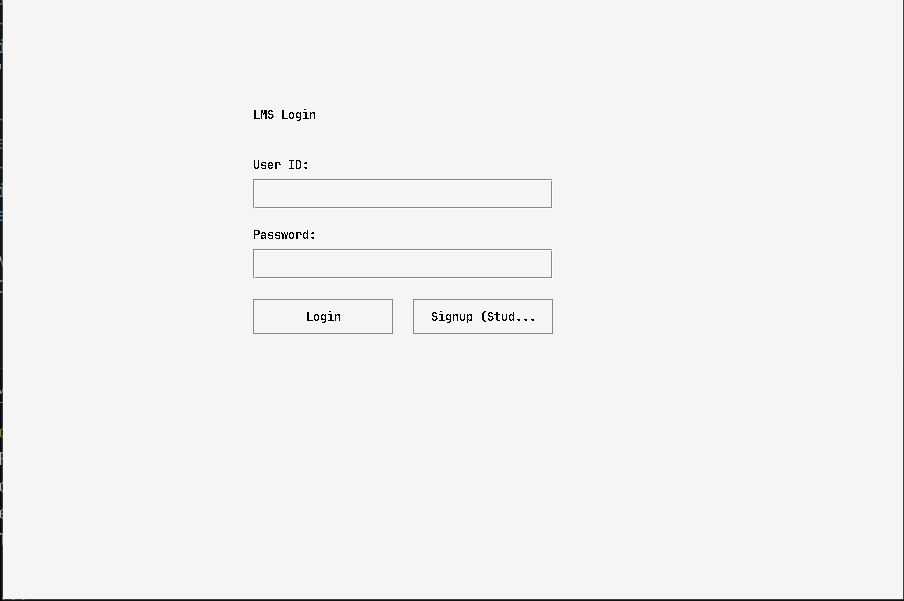
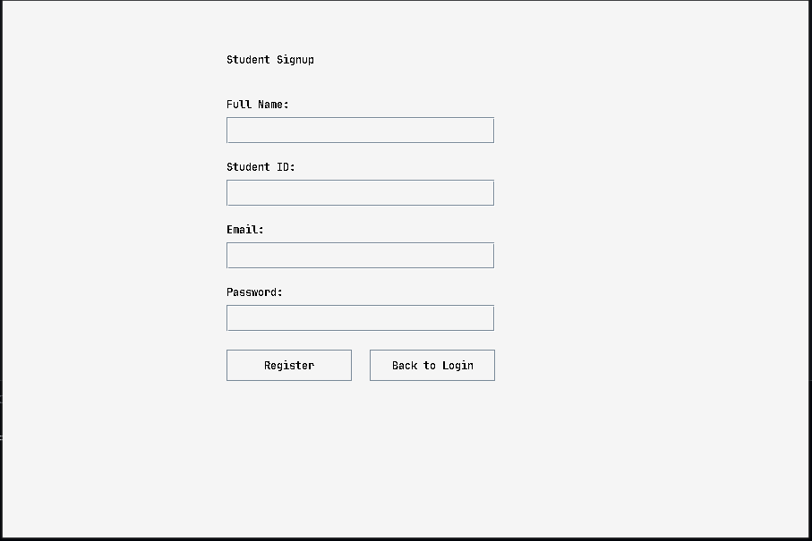
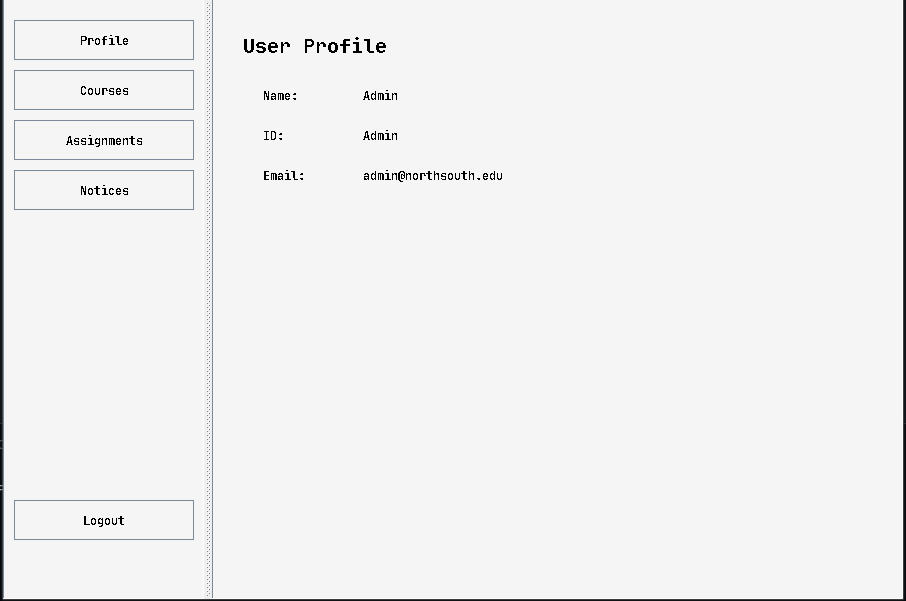
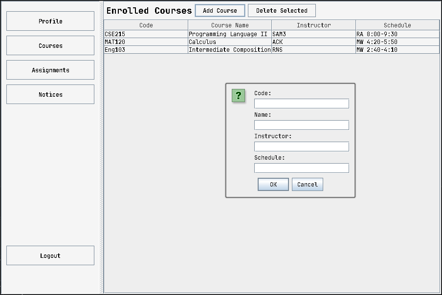
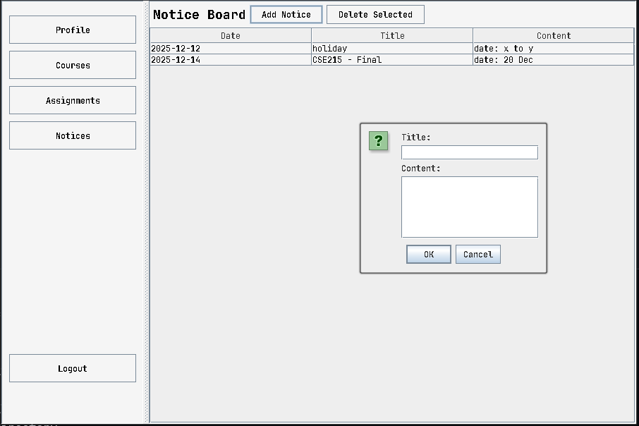
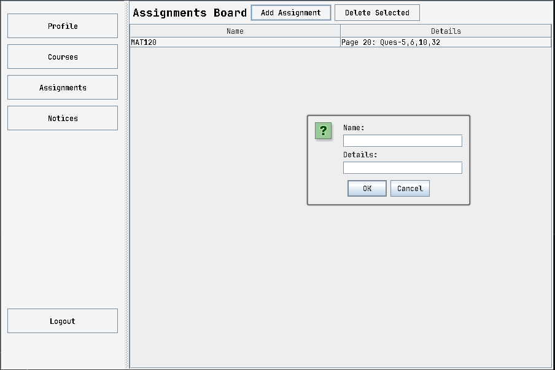

# 🎓 LMS Classroom System


> A comprehensive Learning Management System (LMS) designed to bridge the gap between administrators and students through a clean, efficient, and user-friendly interface.

---

## 📖 Table of Contents
- [About the Project](#-about-the-project)
- [Key Features](#-key-features)
- [Software Architecture](#-software-architecture)
- [Installation & Usage](#-installation--usage)
- [Screenshots](#-screenshots)
- [Technicals](#-technicals)
- [Contributors](#-contributors)

---

## 🚀 About the Project

The **LMS Classroom System** is a desktop application developed in Java. It serves as a centralized platform for academic management, replacing legacy manual systems with a digital solution.

**Purpose:**
To streamline course enrollment, assignment distribution, and notice broadcasting in an educational setting.

**User Roles:**
*   **👨‍🏫 Admin**: Manages the curriculum. Can Create/Delete courses, post assignments, and publish notices.
*   **👨‍🎓 Student**: Consumes content. Can enroll in courses, view dashboard analytics, and check deadlines.

---

## ✨ Key Features

### 🔐 Secure Authentication
*   **Login System**: Secure access with ID and Password verification.
*   **Role Detection**: Automatically redirects to Admin or Student dashboard based on credentials.
*   **Registration**: Easy signup process for new students.

### 📊 Dynamic Dashboard
*   **Profile Card**: Displays user details (Name, ID, Email).
*   **Navigation**: Seamless switching between views (Courses, Assignments, Notices) without reloading.
*   **Real-time Updates**: UI refreshes instantly upon data changes (e.g., enrolling in a course).

### 📚 Course Management
*   **Admin**: Add new courses with details (Code, Name, Instructor, Schedule). Delete outdated courses.
*   **Student**: Browse available courses and enroll with a single click. View enrolled courses list.

### 📝 Assignments & Notices
*   **Assignment Board**: Centralized list of tasks and details.
*   **Notice Board**: Announcements with automatic date stamping.

### 💾 Data Persistence
*   **CSV Database**: All data (Users, IDs, Courses, Enrollments) is saved locally in CSV files.
*   **Reliability**: Data remains intact even after closing the application.

---

## 🏗️ Software Architecture

The project follows a modular **MVC-like** (Model-View-Controller) structure using pure Java.

| Package | Description |
| :--- | :--- |
| **`gui`** | Contains `LMSGui` (Main Window) and `UI` (Swing components wrapper). Handles all user interactions. |
| **`data`** | Contains `UserDataManager` and `DataManager`. Manages file I/O and CSV parsing. |
| **`users`** | Contains the `User` abstract class and its subclasses `Admin` and `Student`. |
| **`core`** | Contains POJO classes: `Course`, `Assignment`, and `Notice`. |
| **`app`** | Contains the `App` entry point. |

**OOP Principles Implemented:**
*   **Encapsulation**: Private fields with strict getters/setters.
*   **Inheritance**: `Student` and `Admin` extend the base `User` class.
*   **Polymorphism**: Dynamic dashboard updates based on `instanceof User`.
*   **Abstraction**: Abstract `User` class enforcing specific behaviors.

---

## 📥 Installation & Usage

### Prerequisites
*   Java Development Kit (JDK) 8 or higher.

### Running the App
1.  **Clone the repository**:
    ```bash
    git clone https://github.com/username/LMS-Classroom.git
    cd LMS-Classroom
    ```
2.  **Compile the code**:
    ```bash
    javac -d bin -sourcepath src/main src/main/app/App.java
    ```
3.  **Run the application**:
    ```bash
    java -cp bin app.App
    ```

*(Note: Ensure `src/main/resources/users/login.csv` exists for data to load correctly)*

---

## 📸 Screenshots

| Login Screen | Signup Screen |
| :---: | :---: |
|  |  |

| Profile Info | Course Menu |
| :---: | :---: |
|  |  |

| Notice Board | Assignment |
| :---: | :---: |
|  |  |

---

## 🛠️ Technicals

*   **Language**: Java (SE)
*   **GUI Framework**: Swing (javax.swing)
*   **Data Format**: CSV (Comma Separated Values)
*   **IDE Used**: VS Code / IntelliJ IDEA
---
## Contributors
*   **[Shamim Al Azad Hasib](https://github.com/Hasib-4174)**
*   **[Orpo Bhowmick](https://github.com/orpo-bhowmick)**
*   **[Hasib Al Hasan](https://github.com/Hasib6783)**
---
*Built with ❤️ for University OOP Project.*
